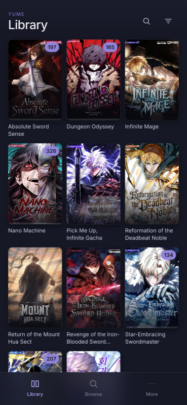
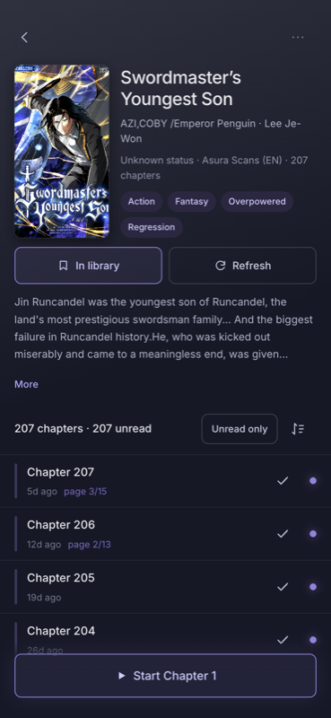
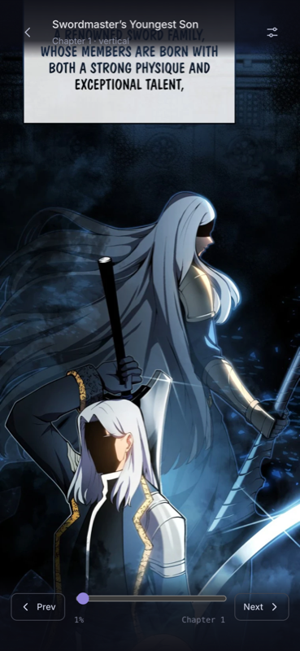
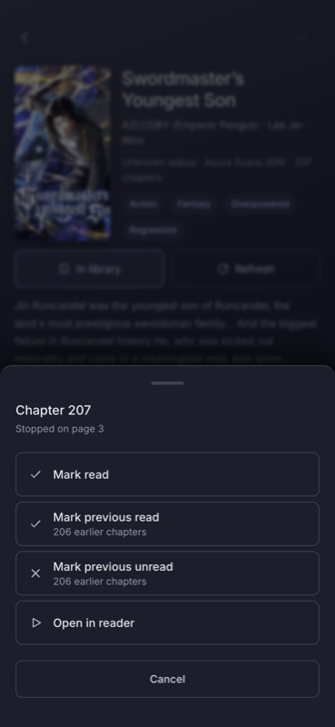
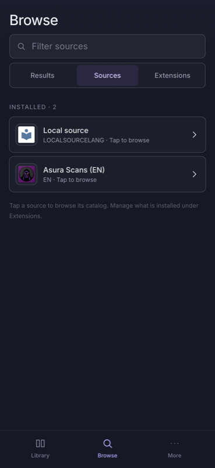
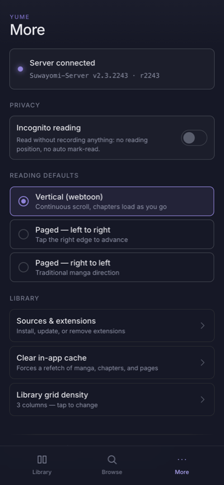

# Yume

A manga reader for a self-hosted [Suwayomi](https://github.com/Suwayomi/Suwayomi-Server)
server — a PWA that installs to the iOS Home Screen from Safari and reads like
a native app.

Plain HTML/CSS/JS: no framework, no build step, no bundler. Files are served
as-authored.

- **Library** with unread badges and per-title reading progress
- **Browse** — search every installed source at once, open a source's catalog,
  install and update extensions
- **Reader** — vertical webtoon with continuous chapter loading, plus paged
  left-to-right and right-to-left
- **Incognito** reading that records nothing back to the server
- Progress syncs to Suwayomi as you read

|  |  |  |
|:--:|:--:|:--:|
|  |  |  |
| **Library** — unread badges, progress rails | **Detail** — chapters, read state, resume | **Reader** — continuous webtoon scroll |
|  |  |  |
| **Chapter menu** — bulk read / unread | **Browse** — sources and extensions | **More** — incognito, reading defaults |

## Requirements

- A running [Suwayomi-Server](https://github.com/Suwayomi/Suwayomi-Server) on
  your network, with at least one extension installed.
- Docker, to run Yume itself. (Node 18+ only if you want the dev server.)
- An iPhone on the same network as both.

## Setup

Tell Yume where your Suwayomi lives:

```bash
cp .env.example .env
```

Then edit `.env`:

```bash
SUWAYOMI=http://192.168.x.x:4567     # your Suwayomi URL
YUME_BASE=http://192.168.x.x:8420    # where Yume will be served
```

`.env` is not tracked by git, so your addresses stay on your machine. A real
environment variable overrides it — `SUWAYOMI=http://other:4567 node
dev-server.js` works for one-offs. Leave it unset and the tools will tell you
it is unconfigured rather than failing obscurely.

## Running it

```bash
node dev-server.js                 # binds 0.0.0.0:8420
node dev-server.js --port 9000     # different port
node dev-server.js --upstream http://your-server:4567
node dev-server.js --verbose       # also log static file requests
```

Every `/api` call is logged with its GraphQL operation name, status, and
timing — the first place to look when something misbehaves on the phone.

The dev server prints its LAN address on startup. Open that on the phone —
same WiFi, no other setup.

Port 8420 is the default, chosen to stay clear of the 8080/8000 range most
self-hosted stacks already use. `--port` overrides it.

## Same-origin, by design

The browser only ever talks to Yume's own origin. Both the dev server and the
nginx container reverse-proxy `/api/*` through to Suwayomi, so:

- `/api/graphql` — the GraphQL endpoint
- `/api/v1/manga/{id}/thumbnail` — covers
- `/api/v1/manga/{id}/chapter/{sourceOrder}/page/{n}` — page images
- `/api/v1/extension/icon/{pkg}` — extension icons

are all same-origin. CORS never enters the picture, and image URLs need no
rewriting since the server returns them relative already.

## Screens

| Route | Screen |
|---|---|
| `#/library` | Cover grid, category strip, unread badge + progress rail per title |
| `#/browse` | Three tabs — **Results** (search every installed source at once), **Sources** (tap one to browse its catalog), **Extensions** (install / update / remove) |
| `#/source/:id` | One source's catalog — Popular / Latest / in-source search, paginated |
| `#/manga/:id` | Hero, metadata, chapter list with read state, resume button |
| `#/reader/:chapterId` | Webtoon continuous scroll + paged LTR/RTL, progress write-back |
| `#/more` | Incognito toggle, server status, reading defaults, cache controls |

## Files

```
index.html          shell + tab bar
manifest.json       PWA manifest (standalone, portrait)
icons/              app icons (SVG + 180/192/512 PNG)
css/style.css       Nocturne tokens + component layer
js/
  app.js            hash router
  api.js            GraphQL client — every operation verified against the live server
  state.js          prefs (localStorage) + per-session cache
  dom.js            el()/icon()/toast() helpers; text nodes only, so no HTML injection
  views/
    library.js  browse.js  source.js  manga-detail.js  reader.js  more.js
dev-server.js       static + /api proxy, binds 0.0.0.0
nginx.conf          same proxy arrangement for the container
Dockerfile          nginx:alpine image
tests/              browser-driven suite (see Testing)
tools/              GraphQL helpers for introspecting a running server
SCHEMA.md           the introspected Suwayomi schema, with verified operations
```

## Design

A dark system called Nocturne: `#161826` ground, a `#9184d9` blurple accent used
as a line or a glow rather than a fill, Inter at weight 500, 8px radii, and a
0.70× density spacing scale. Tokens live at the top of `css/style.css` and
nothing hard-codes a hex the tokens already carry.

Every screen shares the same vocabulary — outlined buttons, 44px minimum touch
targets, 16px inputs (anything smaller makes iOS zoom on focus), and the accent
reserved for state rather than decoration.

The original design bundle, including the interactive prototype the Library and
Reader were built from, is in `yumeyomi-personal-manga-reader/`.

## Testing

There is no unit-test framework. The suite drives headless Chrome over the
DevTools protocol at iPhone dimensions and asserts on console errors, network
events, rendered DOM, and decoded screenshot pixels:

```bash
node tests/run.cjs                 # everything (~7 min)
node tests/run.cjs visual touch    # only files matching those names
```

The pixel assertions exist because two real bugs were invisible to DOM
assertions alone: a full-bleed tap overlay that made the reader unscrollable on
a phone, and a 1px border that drew a seam through webtoon artwork. Setting
`scrollTop` in a test does not prove a page is scrollable — it bypasses
hit-testing — so anything touch-related uses synthesized gestures.

The suite talks to a real Suwayomi server and mutates real state (marking
chapters read, adding to the library). Each test captures what it changed and
restores it in a `finally`.

## Deploying

The app is a static bundle plus an nginx reverse proxy, so it runs anywhere
Docker does:

```bash
cp .env.example .env        # set SUWAYOMI / YUME_BASE
docker compose up -d --build
```

Then install it on your phone — see below.

`YUME_UPSTREAM` in `docker-compose.yml` tells nginx where Suwayomi lives. The
default assumes Suwayomi is reachable on the Docker host; if it is a service on
the same compose network, set it to that service name instead.

### If Suwayomi runs behind a VPN container

A common self-hosted layout puts Suwayomi inside a VPN container's network
namespace (`network_mode: container:gluetun`). Suwayomi then has **no network
or DNS name of its own** — the VPN container publishes its port — so a sidecar
cannot reach it by service name.

The shipped default handles this: Yume talks to `host.docker.internal:4567` via
`extra_hosts: host-gateway`, so it never has to join the VPN container's
network.

### Two nginx footguns worth knowing

Both of these were found by deploying rather than assuming, and both are
already handled in `nginx.conf`:

- **nginx's `resolver` does not read `/etc/hosts`.** A variable `proxy_pass`
  cannot resolve a `host-gateway` entry, so `proxy_pass` uses the
  envsubst-substituted `${YUME_UPSTREAM}` literal, which the system resolver
  handles.
- **`localhost` resolves to `::1` in `nginx:alpine`** while nginx listens on
  IPv4 only, so the healthcheck uses `127.0.0.1`.

## Installing it on an iPhone

Yume is a PWA, so there is no App Store, no sideloading, and no signing. Safari
installs it directly:

1. Open **Safari** on the iPhone and go to `http://<your-server>:8420`.
   It has to be Safari — Chrome and Firefox on iOS cannot install web apps.
2. Tap the **Share** button (the square with an arrow, in the bottom bar).
3. Scroll down and tap **Add to Home Screen**.
4. Name it and tap **Add**.

You now have a Yume icon on the Home Screen. Opening it launches full-screen
with no browser chrome — no address bar, no tabs — and it keeps its own history
stack, so the back gesture works inside the app rather than leaving it.

A few things worth knowing:

- **The phone must be able to reach the server**, so stay on the same network
  (or on a VPN back to it). There is no cloud component; nothing leaves your
  network.
- **Updating the app**: reload the page and the new version is live — it is
  served fresh every time, with no cached bundle. The one exception is
  `index.html`'s meta tags and `manifest.json`, which iOS reads *at install
  time*; changing those needs the icon deleted and re-added.
- **Reading position syncs to Suwayomi**, so picking up on another device
  continues where you left off.

## Roadmap

`docs/ROADMAP.md` sketches the next piece of work — user-selectable themes,
including what in the current CSS blocks it and in what order to tackle it.

## Notes

- Reading progress writes back to the server (throttled while scrolling, flushed
  on exit). Chapters auto-mark read on the last page.
- **Incognito** (More → Privacy) stops the reader recording anything: no
  position writes, no auto mark-read. Deliberate actions still work — adding to
  the library or tapping a chapter's read toggle are choices, not history. The
  reader chrome shows an INCOGNITO badge whenever it is active.
- Screen Wake Lock keeps the display on while reading where supported.
- No service worker — the manifest alone is enough for Add to Home Screen, and
  chapters are always fetched live rather than cached offline.
- Chapters are always fetched live; the in-memory cache is per-session only.
- Navigation uses a real history stack (`pushState`), so Back unwinds
  reader → detail → source → browse. Tab switches *replace* the current entry
  rather than stacking, so Back never walks a trail of tab taps.
- The reader has no tap overlay: chrome toggles from a tap detected on the
  scrolling element itself (under 10px of movement, no scroll, under 500ms),
  which leaves touch scrolling completely unobstructed.
- The scrub bar is scoped to the current chapter — it scrolls the column in
  webtoon mode and steps pages in paged mode.
- **Page prefetch:** the reader keeps 3 image requests in flight at all times,
  refilling the instant one finishes, within a 5-page window ahead of where you
  are. `loading="lazy"` is deliberately not used — its fixed ~1250px trigger
  distance is a fifth of one 6000px webtoon strip, which collapsed the buffer
  to about one page. Tune `MAX_IN_FLIGHT` / `PREFETCH_AHEAD` at the top of
  `js/views/reader.js` if the server needs a lighter touch.
- Sources and extensions live on separate tabs on purpose: an installed
  extension usually provides a source of the same name, so a combined list
  showed each one twice. Each tab keeps its own search field.
- Opening a title discovered through a source catalog triggers a chapter fetch
  automatically — Suwayomi only scrapes a series' chapters on demand, so
  without it the list would render empty.
- First load of any cover takes a few seconds while Suwayomi fetches and caches
  it from the source; subsequent loads are fast.
